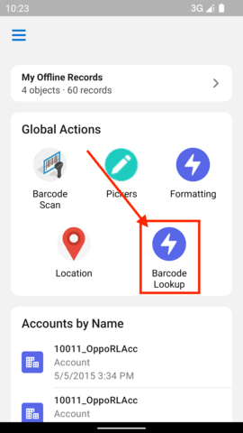

# Barcode Scanner

[The barcode scanner starter kit example](../force-app/main/default/lwc/scanBarcodeLookup/) provides an LWC triggered from a global quick action on the landing page, for a user to scan a barcode and do a record lookup based on its value. Upon scanning the barcode of a supported type, the component does a GraphQL query on the returned value, to search the `Product` records with a matching barcode value, and displays the associated record to the user.

Note that records prefetched in the briefcase can be searched while the device is offline.

# Configure Barcode Scanner

1. [Configure your Offline Briefcase](../README.md#define-an-offline-briefcase) with the `Product` sObject.

2. Make the Barcode Lookup global quick action available on your landing page. You can do this either by configuring the landing page to show _all_ global quick actions on the page, or by configuring the Barcode Lookup global quick action specifically.  

   See the "Global Actions" section of the [Customize The Landing Page](https://help.salesforce.com/s/articleView?id=sf.salesforce_app_plus_offline_landing_page.htm&type=5) documentation, which will show you how to configure your chosen option for displaying global quick actions on your landing page. You can also consult one of the landing page templates in the project, such as [`landing_page_healthcare.json`](../force-app/main/default/staticresources/landing_page_healthcare.json), to see how the configuration steps in the docs are implemented in the landing page templates.

3. Deploy the [`scanBarcodeLookup`](../force-app/main/default/lwc/scanBarcodeLookup) LWC, the [`viewProduct2Record`](../force-app/main/default/lwc/viewProduct2Record) LWC, the [`Product2 view`](../force-app/main/default/quickActions/Product2.view.quickAction-meta.xml) quick action, the [`scanBarcodeLookup`](../force-app/main/default/quickActions/scanBarcodeLookup.quickAction-meta.xml) quick action, `landing_page.json` and `landing_page.resource-meta.xml` to your org.

4. Add the global action to publisher layout. 

    

5. After setting up the `scanBarcodeLookup` LWC, it can now be used as a Global Quick Action within the landing page. 

    

6. When you tap on the Barcode Lookup Global Quick Action in the app, you should see a screen with a Scan Barcode button.

    > **Note**
    > Only the prefetched records in the briefcase can be searched when using this quick action while your device is offline.

7. Click the Scan Barcode button to see the camera preview. 

8. Use the camera to scan an EAN-13 barcode.

9. Upon scanning the barcode, you should be presented with a view of the `Product` record associated with the `ProductCode` value encoded in the barcode. If no record is found for that product code / barcode, an error screen is displayed.